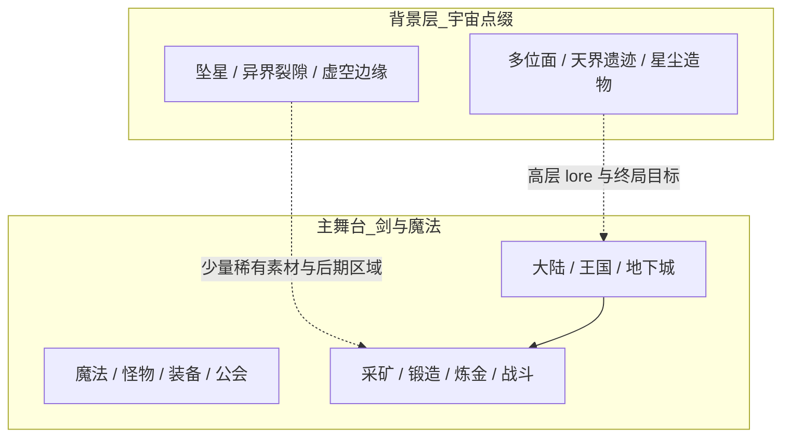
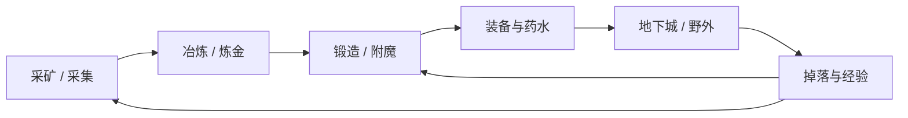

# 核心定位

> 状态：**部分已确认** · 最后更新：2026-09-01

## 项目命名

| 项 | 内容 |
|----|------|
| 英文名 | UniverIdle |
| 中文名 | 宇宙无敌放置游戏 |
| 题材 | **剑与魔法异世界为主，宇宙要素为点缀**（已确认） |

主舞台是 **剑与魔法异世界**：魔法、怪物、地下城、锻造、炼金、冒险者成长。  
「宇宙 / Univer」不作为星际科幻主线，而是 **奇幻侧的宏大背景**——多位面、天界、虚空、坠星、异界遗迹等，用魔法世界观去解释，而非飞船与星舰。

**体感目标**：玩家觉得在玩 **奇幻放置**（接近 Melvor 气质），偶尔遇到「来自星海/虚空的异物」作为惊喜与高层内容，而不是在玩太空游戏。

## 世界观层次（奇幻为主）



### 题材表达要点

- **主语言是奇幻**：剑、盾、法杖、药草、哥布林、龙、附魔、公会任务
- **宇宙不抢戏**：不用飞船、星舰、科幻 HUD；「星」多指 **坠星、星尘魔力、星空彼岸的位面**
- **合体方式**：宇宙要素 = **异界层 / 稀有来源 / 后期地图**，不是第二套科幻玩法
- 采集物以经典奇幻为主：铜矿、药草、魔晶、兽皮；「星铁」「虚空碎片」等作 **稀有进阶材料**
- 区域以森林、矿洞、遗迹、地下城为主；「虚空裂隙」「坠星坑」等作 **后期或支线**
- 文案与 UI 气质见 [题材呈现与世界观](06-题材呈现与世界观.md)

## 与 Melvor Idle 的关系

**方向：借鉴核心，题材与部分系统创新**（非 1:1 复刻）

### 保留（Melvor 精髓）

- 多技能、动作队列、等待完成
- 资源链：采集 → 加工 → 装备/消耗
- 离线收益与长期精通（Mastery）式成长
- UI 为主、数值驱动的战斗与生产

### 差异化

| 方面 | 方向 |
|------|------|
| 题材 | **剑与魔法异世界为主**，宇宙/多位面作背景点缀 |
| 资源 | 奇幻材料占 80%+；星尘/虚空/异界物作稀有层 |
| Meta 层 | 大陆探索、技能精通、公会声望；后期可接「位面之外」 |
| MVP 裁剪 | 首版可不做宠物、公会、多章节剧情、Mod |

## 待定决策

### A. 题材 — 已确认

**剑与魔法异世界为主；宇宙 / 多位面 / 坠星等作背景点缀，不做星际科幻主线。**

### B. 首发平台 — 已确认

**先做 PC，手机后续再做。**

| 阶段 | 平台 | 说明 |
|------|------|------|
| MVP / 首版 | **Windows PC** | 开发与自测主战场，先跑通完整闭环 |
| 二期 | 移动端（Android → iOS） | PC 版稳定后再做 UI 适配与出包 |

#### 为什么这样排

- **开发更快**：不用同时兼顾触控、安全区、多分辨率，先把玩法和平衡做对
- **Melvor 用户习惯**：PC 挂机放置体验成熟，验证核心乐趣成本更低
- **手机不白做**：玩法逻辑与 UI 分离、少用固定像素布局，二期移植时仍省事

#### PC 首版时的轻量预留（不增加 MVP 工作量）

1. 玩法代码不写在 UI 脚本里  
2. Canvas 用 Scaler 适配，窗口可缩放  
3. 存档路径用 `Application.persistentDataPath`（换平台不用改逻辑）  
4. 离线时间用 UTC 时间戳  

> 手机版上线前再专门做：竖屏布局、触控热区、安全区、切后台存档策略。

### C. MVP 范围

**建议第一版目标**：30 分钟～2 小时可玩闭环。

```
采集(2技能) → 制作(1技能) → 简单战斗(1区域) → 存档 + 离线收益
```

| 包含 | 不包含（后续版本） |
|------|-------------------|
| 约 4 个技能 | 宠物系统 |
| 1 个战斗区域 | 公会 / 多人 |
| 基础背包与装备 | 多章节剧情 |
| 本地存档 + 离线收益 | Mod 支持 |
| | 精通等深度元系统（可二期） |

| 选项 | 描述 |
|------|------|
| **C1** | 接受上述 MVP — **当前倾向** |
| C2 | 更简：仅采集 + 制作，战斗后续再加 |
| C3 | 更野心：地牢 / 多区域 / 精通等一并纳入 |

**当前状态**：未确认

## MVP 闭环示意（奇幻为主）



后期可在链末接入：**坠星矿坑、虚空裂隙** 等宇宙点缀区域，提供稀有材料，但不改变主循环的奇幻基调。

> 技能命名与数量见 [技能与经济](02-技能与经济.md)。

## 下一步

确认 **C（MVP）** 后，进入第 2 步：技能列表与资源经济草图。
